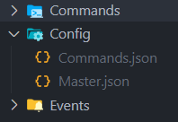

# Conecta! Interchat
*Connecting servers has never been this easy.*

<hr />

# Installation

## Setup
```
npm i
```
> If you are on a development enviroment:
```
node deploy-devcmd.js
nodemon bot.js
```
> If you are on a production enviroment:
```
node deploy-command.js
node bot.js
```

## Config files:
**You must create a "Config", and inside it create a `Commands.json` and `Master.json` before starting the bot.**

**Commands.json**
```json
{
	"token": "BOT TOKEN",
	"clientId": "BOT ID",
	"guildId": "DEV GUILD ID",
	"errorChannel": "DEV GUILD CHANNEL ID FOR ERRORS"
}
```

**Master.json**
```json
{
    "token": "BOT TOKEN",
    "dbURL": "MongoDB DB URL"
}
```
<p align="center">It should look like this: </p>

<p align="center">
  
</p>